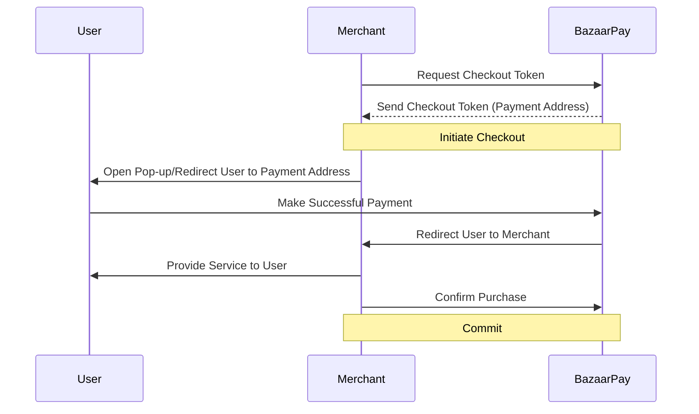

The payment process that the user goes through to pay money to the merchant is called Checkout.
The token attribute of a Checkout consists of English letters and numbers. It is mandatory to keep this token in the Merchant for tracking, confirming the purchase (commit), and refunding.

Initially, by calling the [init checkout] endpoint (./payment.md#init-checkout), a token is received along with a URL that can be used for the payment process. Then, using our SDK (it is also possible to use it without the SDK, as explained earlier) and by calling the appropriate function, the payment process popup/browser tab/bottom sheet will be opened (depending on the user's profile and the payment method selected, different scenarios may be executed for the user). Finally, after going through the payment flow, the user is returned to the accepting application or site by closing the popup/browser tab/bottom sheet. Here, the provided SDK, after checking the validity of the payment by calling the given callback, gives the merchant a success message and the merchant provides the service to the user. After providing its product or service to the user, the acceptor calls the [commit](./payment.md#commit) endpoint to confirm the service provision (if this endpoint is not called, the entire transaction will be automatically returned to the user's wallet after 10 minutes). This endpoint is actually used to implement the two-phase commit protocol between BazaarPay and the acceptor. Other endpoints will be used as auxiliary endpoints outside the payment scenario. <h2 id="important-points">Notes</h2>

<h3 id="server-addresses">Endpoint and web based addresses and paths</h3>

To view the endpoint and web based addresses, refer to the following file:
[Base address and path](./shared-components/servers.md)

<h3 id="common-errors">Common errors in responses</h3>

To view the common errors in responses, refer to the following file:
[Common errors](./shared-components/error-responses.md)

<h2 id="other-details">Other details</h2>

1. All endpoints are in REST format. Requests should preferably be sent in JSON format with the `Content-Type: application/json` header in the request Body. Responses will also be returned in JSON format.

2. All URLs must have trailing slashes.

3. In case of any error, the request response will be returned in json format along with the corresponding http status code and the detail field or the input parameter field of the same name.

If needed, you can see the following file:

[Error Schema Sample](./shared-components/error-responses.md)

4. Most error responses include a detail key in the response body. Validation errors are a little bit different and include the field names as keys in the response. If the validation error is not specific to a field, the non_field_errors key is used. For example:

```
{"checkout_token": ["This field is required."]}
{"detail": "Insufficient balance."}
{"detail": "Internal Server Error"}
```

<h2 id="how-to-use-bp">How to use BazaarPay</h2>

<h3 id="how-to-use-bp-web">Web</h3>

[Implementing BazaarPay on the web](./payment.md#payment-flow-web)

<h3 id="how-to-use-bp-android">Android</h3>

You can use the specific SDK for the Android platform. For more information, see the following section:

[Implementing BazaarPay for Android Platform with Android SDK](./payment.md#payment-flow-android)

<h2 id="login-by-merchant">User Authentication by Merchant</h2>
To use the automatic authentication feature of BazaarPay by Merchant, you can refer to the following documentation:

[User Authentication by Merchant](./auto-login.md)

<h2 id="best-practice">Best Practices</h2>

1. Protect your Authorization Token! Do not store it on the client side or any other service whose binary or source code is discoverable by your users.

2. After providing the service or registering the ownership of the given product to the user persistently and in an atomic transaction, call the [commit](./payment.md#commit) endpoint.

3. To call the [commit](./payment.md#commit) endpoint, have a retry mechanism. Preferably, this mechanism should be implemented as a queue. For example, if you encounter an error while calling this endpoint, a cron job should try to call this endpoint again every 5 minutes. Preferably, the refund endpoint should also be called in the backoff mechanism of this retry. The reason for this is to prevent the double spending bug in case the commit is registered on the BazaarPay servers but the response has not reached the endpoint caller.

4. Fill in the `User-Agent` header in the requests according to your service.

5. If the request is made from the merchant servers, always send the Authorization token in the headers for better tracing.