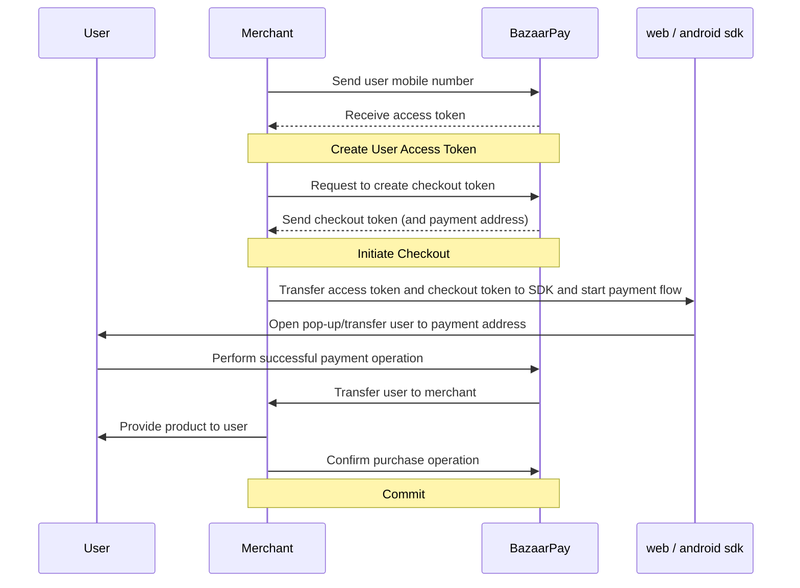

<h1 id="login-by-merchant">User Authentication by Merchant</h1>

In this process, instead of authenticating (logging in) to BazaarPay, the user authenticates on the merchant’s site or application
and then the mobile number is sent to BazaarPay by the merchant so that an access token can be created for this mobile number and used to access BazaarPay services
. Please note that this access token must be recreated for each payment process.

In this case, the user does not need to log in separately to BazaarPay. Client SDKs
that support this automatic authentication feature (Android SDK
from [version 5.2.0](https://github.com/cafebazaar/BazaarPay/releases/tag/5.2.0)),
use the access token provided by the merchant to continue the user's operation if the user is not already logged in to BazaarPay.

You can see the sequence diagram of this process below:



<h2 id="create-user-access-token">Getting an access token for the user from the acceptor</h2>

After authenticating the user on its site, the acceptor can get an access token for the user's mobile number via the `create-user-access-token` endpoint.

This access token can only be used for one of the following three scopes:

1. purchase: For purchases via wallet, bank gateway, or direct debit

2. increase_balance: For the process of directly increasing the wallet balance

3. direct_pay: For the automatic payment process

If you use the token created in another scope, you will encounter a 403 error.

<h3 id="create-user-access-token-sample">Request Sample</h3>

```yaml
openapi: 3.1.0
info:
  title: Create User Access Token API
  version: 1.0.0
servers:
  - url: 'https://{base_url}{base_path_v1}'
    description: BazaarPay API v1
paths:
  /merchant/create-user-access-token/:
    post:
      requestBody:
        content:
          application/json:
            schema:
              type: object
              properties:
                user_phone_number:
                  type: string
                  required: true
                  example: "09123456789 or 989123456789"
                  description: Use phone number (according to the format in samples)
                scope:
                  required: true
                  type: string
                  enum:
                    - purchase
                    - increase_balance
                    - direct_pay
                  example: "purchase"
                  description: |
                    - purchase: Get tokens for the purchase process (purchase via wallet, bank gateway, or direct debit)
                    - increase_balance: Get tokens for the balance increase process directly
                    - direct_pay: Get token for the automatic payment process (DirectPay)
      responses:
        '200':
          description: Success
          content:
            application/json:
              schema:
                type: object
                properties:
                  access_token:
                    type: string
                    example: "A1023e71738b4c1045529003314f429f0.81f023z="
        '401':
          $ref: './en/shared-components/error-responses.md#/responses/401'
        '403':
          description: Permission Denied
          content:
            application/json:
              schema:
                oneOf:
                  - $ref: './en/shared-components/error-responses.md#/responses/403/content/application/json/schema'
                  - $ref: '#/components/schemas/AutoLoginResponse'
        '400':
          $ref: './en/shared-components/error-responses.md#/responses/400'
        '503':
          $ref: './en/shared-components/error-responses.md#/responses/503'
components:
  securitySchemes:
    ApiKeyAuth:
      $ref: './en/shared-components/security.md#/securitySchemes/ApiKeyAuth'
```

<h3 id="create-user-access-token-sample-curl">cURL sample</h3>

```curl
curl --request POST 'https://api.bazaar-pay.ir/badje/v1/merchant/create-user-access-token/' \
--header 'Content-Type: application/json; charset=utf-8' \
--header 'Authorization: Token {merchant_token}' \
--data-raw '{
    "scope": "purchase",
    "user_phone_number": "09123456789"
}'
```

<h3 id="create-user-access-token-sample-success-response">Sample Success Request Response</h3>

```json
{
  "access_token": "A1y.023e717-8b4c1045529003314f429f0.81f023z="
}
```

If the acceptor receives a response with status code 403,
it should continue the payment process without an automatic access token.
This may occur due to the temporary disabling of automatic authentication for technical reasons.

<h2 id="auto-login-android">Automatic Authentication on the Android Platform</h2>

To see how automatic authentication is enabled in the Android SDK,

see the [sdk documentation](https://github.com/cafebazaar/BazaarPay#2-launch-payment).

<h2 id="auto-login-web">Automatic authentication on the web platform</h2>

This service receives the user's authentication token using the query param and performs the desired processes using the authenticated token.

<h4 id="direct-call">Direct web service call</h4>

At each entry point of the web service, by passing the query param `auto_login_token`, the web service will recognize the authentication method as autologin and by the end of the desired process, the user will be authenticated with that token. Keep in mind that the value of this query param must be initialized by `access_token`, which is returned in the `create-user-access-token` endpoint.

<h4 id="direct-call-query-params">Query Param Structure</h4>

```yaml
queryParams:
  # AutoLogin Query Param
  - name: auto_login_token
    type: string
    description: User's Auto Login access token
    example: eyJhwGciOsJIUzIdiIsInf5cCI6vIkfXrwJ9.eyJpc3MeOiJiYrwYqwYceirC
```

<h4 id="normal-auth-payment-sample-address">Sample payment address without auto-login</h4>

```
https://{base_url}{base_path}/payment?token={checkout_token}&redirect_url={merchant_redirect_url}
```

<h4 id="auto-login-payment-sample-address">Sample payment address with auto-login</h4>

```
https://{base_url}{base_path}/payment?token={checkout_token}&redirect_url={merchant_redirect_url}&auto_login_token={auto_login_token}

```

<h4 id="auto-login-payment-sample-address-usage">Auto-login sample usage</h4>

```
https://app.bazaar-pay.ir/payment?token=2220203584&redirect_url=https://bazaar-pay.ir&auto_login_token=eyJhwGciOsJIUzIdiIsInf5cCI6vIkfXrwJ9.eyJpc3MeOiJiYrwYqwYceirC

```

<h2 id="get-user-phone-from-access-token">Get user's mobile number from access token</h2>

Clients and SDKs can use To get the user's mobile number from the access token
and display the mobile number in the UI, use the `user/info/` endpoint.

<h3 id="get-user-phone-from-access-token-sample">Sample Request</h3>

```yaml
openapi: 3.1.0
info:
  title: Get User Info API
  version: 1.0.0
servers:
  - url: 'https://{base_url}{base_path_v1}'
    description: BazaarPay API v1
paths:
  /user/info/:
    get:
      responses:
        '200':
          description: Success
          content:
            application/json:
              schema:
                type: object
                properties:
                  phone_number:
                    type: string
                    example: "989123456789"
        '401':
          $ref: './en/shared-components/error-responses.md#/responses/401'
        '403':
          $ref: './en/shared-components/error-responses.md#/responses/403'
        '400':
          $ref: './en/shared-components/error-responses.md#/responses/400'
        '503':
          $ref: './en/shared-components/error-responses.md#/responses/503'
components:
  securitySchemes:
    ApiKeyAuth:
      $ref: './en/shared-components/security.md#/securitySchemes/ApiKeyAuth'
```

<h3 id="get-user-phone-from-access-token-sample-curl">Sample cURL</h3>

```curl
curl 'https://api.bazaar-pay.ir/badje/v1/user/info/' \
     --header 'Authorization: Bearer {user_access_token}' \
     --header 'Accept: application/json'
```

<h3 id="get-user-phone-from-access-token-sample-success-response">Sample successful response</h3>

```json
{
	"phone_number": "989123456789"
}
```

<h3 id="get-user-phone-from-access-token-sample-errors">Sample Error</h3>

```yaml
components:
  schemas:
    AutoLoginResponse:
      type: object
      properties:
        detail:
          oneOf:
            - type: array
              items:
                type: string
            - type: string
        examples:
          permission_denied:
            summary: When the acceptor does not have the necessary access to create tokens (for purchases or balance increase or automatic payments)a
            value:
              detail: "You cannot use auto-login for purchase."
```
