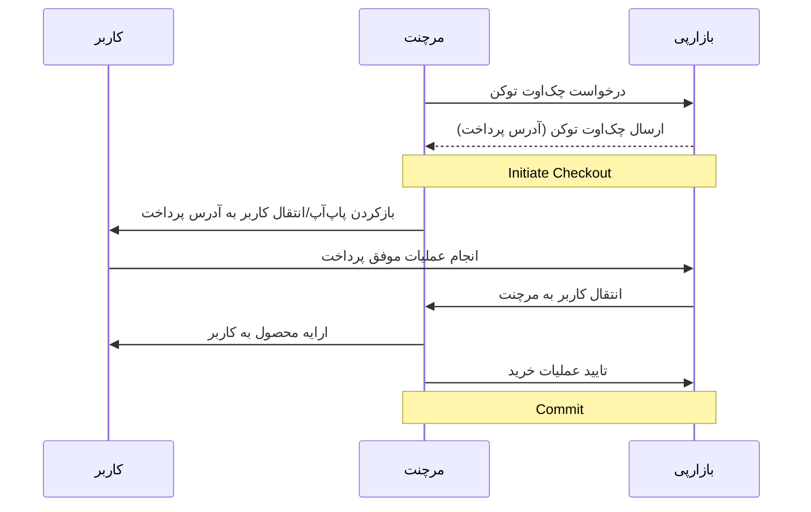

به فرآیند پرداختی که کاربر آن را طی می‌کند تا پولی را به پذیرنده (merchant) بپردازد، چک‌اوت (Checkout) گفته می‌شود.
مشخصه‌ی چک‌اوت یک توکن شامل حروف و اعداد انگلیسی می‌باشد. حفظ این توکن نزد پذیرنده برای پیگیری، تایید خرید (commit) و
برگشت
پول (refund) الزامی است.

در ابتدا با صدا زدن اندپوینت [init checkout](./payment.md#ایجاد-چکاوت-توکن) یک توکن به همراه یک URL که می‌توان برای
فرآیند پرداخت از آن‌ها استفاده کرد، دریافت می‌شود. سپس
توسط SDK توسعه داده شده (امکان استفاده آن بدون SDK نیز وجود دارد که جلوتر توضیح داده شده است) و با صدا زدن تابع مناسب،
پاپ‌اپ/تب مرورگر/باتم‌شیت فرآیند پرداخت باز خواهد شد (بسته به مشخصات کاربر و متد
پرداختی انتخاب شده، سناریوهای متفاوتی برای کاربر ممکن است اجرا شود). در نهایت کاربر پس از گذراندن فلوی پرداخت، با بسته
شدن پاپ‌اپ/تب مرورگر/باتم‌شیت به اپلیکیشن یا سایت پذیرنده بازگردانده می‌شود. در این جا SDK ارایه شده پس از بررسی صحت
پرداخت با صدا زدن
کال‌بک داده شده، پیام موفق بودن را به مرچنت داده و مرچنت خدمت را به کاربر ارایه می‌کند. پذیرنده پس از ارایه‌ی محصول یا
خدمات خود به کاربر اندپوینت
[commit](./payment.md#تایید-خرید) را صدا می‌زند تا صحت ارایه‌ی خدمت را تایید کند (در صورت عدم صدا زدن این اندپوینت کل
مبلغ تراکنش به صورت خودکار
بعد از حداکثر ۱۰ دقیقه به کیف پول کاربر باز خواهد گشت). این اندپوینت در واقع برای پیاده‌سازی پروتکل two-phase commit بین
بازارپی و پذیرنده استفاده می‌شود.
سایر اندپوینت‌ها به عنوان اندپوینت‌های کمکی و خارج از سناریوی پرداخت استفاده خواهند شد.

## نکات مهم

### آدرس و مسیر پایه اندپوینت‌ها و وب

برای مشاهده آدرس پایه اندپوینت‌ها و وب به فایل زیر مراجعه کنید:  
[آدرس و مسیر پایه](./shared-components/servers.md)

### ارورهای متداول در پاسخ درخواست‌ها

برای مشاهده ارورهای متداول در پاسخ درخواست‌ها به فایل زیر مراجعه کنید:  
[ارورهای متداول](./shared-components/error-responses.md)

## سایر توضیحات

۱. تمامی اندپوینت‌ها با معماری REST هستند. ترجیحا درخواست‌ها تحت قالب JSON و در Body درخواست با
هدر `Content-Type: application/json` ارسال شوند. پاسخ‌ها نیز به صورت JSON بازگردانده خواهند شد.

۲. در تمامی آدرس‌ها باید اِسلَش انتهای آدرس‌ها (trailing slash) رعایت شود.

۳. در صورت بروز هرگونه خطا، پاسخ درخواست همراه با http status code مربوط و همچنین فیلد detail و یا فیلد همنام پارامتر
ورودی در قالب یک json برگردانده خواهند شد.
در صورت نیاز می‌توانید فایل زیر را مشاهده کنید:

[نمونه اسکیما ارور](./shared-components/error-responses.md)

۴. اکثر پاسخ های خطا شامل یک کلید detail در بدنه پاسخ هستند. خطاهای اعتبارسنجی کمی متفاوتند و نام فیلدها را به عنوان
کلید در پاسخ شامل می‌شود. اگر خطای اعتبارسنجی مختص یک فیلد خاص نبود، از کلید non_field_errors استفاده می‌شود. برای
مثال:

```
{"checkout_token": ["This field is required."]}
{"detail": "Insufficient balance."}
{"detail": "Internal Server Error"}
```

## نحوه‌ی استفاده از بازارپی

### وب/سایر پلتفرم‌ها

شما می‌توانید با پلتفرم وب، با دو روش بازارپی را پیاده‌سازی نمایید. برای اطلاعات بیشتر به قسمت زیر مراجعه کنید:

[پیاده‌سازی بازارپی با پلتفرم وب با SDK](./payment.md#web-sdk)

[پیاده‌سازی بازارپی با پلتفرم وب بدون استفاده از SDK](./payment.md#without-sdk)

### اندروید

شما می‌توانید برای پلتفرم اندروید از SDK مخصوص به آن استفاده نمایید. برای اطلاعات بیشتر به قسمت زیر مراجعه کنید:

[پیاده‌سازی بازارپی برای پلتفرم اندروید با SDK اندروید](./payment.md#android-sdk)

## احراز هویت کاربر توسط پذیرنده
برای استفاده از قابلیت احراز هویت اتوماتیک کاربران در بازارپی توسط پذیرنده، می‌توانید به مستندات زیر مراجعه کنید:

[احراز هویت کاربر به واسطه‌ی پذیرنده](./auto-login.md)

## بهترین الگو‌ها

۱. از Authorization Token خود محافظت کنید! آن را در سمت کلاینت یا هر سرویس دیگری که باینری یا سورس کد آن قابل کشف برای
کاربران شما می‌باشد ذخیره نکنید.

۲. پس از ارایه‌ی خدمت و یا ثبت مالکیت محصول داده شده به کاربر به صورت پایدار (persistent) و در یک تراکنش اتمیک، اندپوینت
[commit](./payment.md#تایید-خرید) را صدا بزنید.

۳. برای صدا زدن اندپوینت [commit](./payment.md#تایید-خرید) مکانیسم تلاش مجدد retry داشته باشید. ترجیحا این مکانیسم به
صورت صف پیاده شود. برای مثلا
اگر در کال کردن این اندپوینت با ارور مواجه شدید، یک کرون جاب در بازه‌های ۵ دقیقه‌ای، اقدام به صدا زدن مجدد این اندپوینت
کند.
ترجیحا در مکانیسم backoff این retry، اندپوینت refund نیز صدا زده شود. علت این موارد این است که از باگ double spending در
حالتی که کامیت سمت سرورهای بازارپی ثبت شده باشد ولی پاسخ آن به دست صداکننده‌ی اندپوینت نرسیده باشد جلوگیری شود.

۴. هدر `User-Agent` در ریکوئست‌ها را متناسب با سرویس خود پر کنید.

۵. درصورتی که ریکوئست از سمت سرورهای مرچنت زده می‌شود، همواره توکن Authorization را برای تریس بهتر در هدرها ارسال کنید.

۶. پس از برگشت کاربر از درگاه بازارپی، اندپوینت [Trace](./payment.md#پیگیری-خرید) را برای پیگری و اطمینان از صحت پرداخت
صدا بزنید.

۷. در صورتی که در جواب اندپوینت [Trace](./payment.md#پیگیری-خرید) مقدار status برابر با unpaid بود به این معنی است که
وضعیت پرداخت هنوز نهایی نشده و
ممکن است کاربر هنوز در حال پرداخت باشد. در این صورت لازم است دقایقی دیگر (حداکثر ۱۰ دقیقه) دوباره وضعیت پرداخت را
استعلام کنید تا وضعیت نهایی مشخص شده باشد.

- [Basic Payment Flow](./payment.md)
- [DirectPay](./direct-pay.md)
- [Wallet Integration](./wallet.md)
