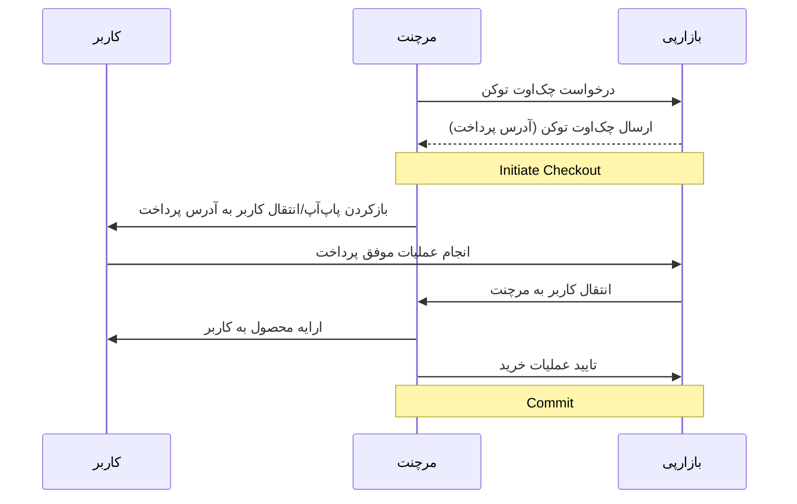

به فرآیند پرداختی که کاربر آن را طی می‌کند تا پولی را به پذیرنده (merchant) بپردازد، چک‌اوت (Checkout) گفته می‌شود.
مشخصه‌ی چک‌اوت یک توکن شامل حروف و اعداد انگلیسی می‌باشد. حفظ این توکن نزد پذیرنده برای پیگیری، کامیت (commit) و برگشت
پول (refund) الزامی است.

در ابتدا با صدا زدن ای‌پی‌آی init checkout یک توکن به همراه یک url برای فرآیند پرداختی که شروع می‌شود دریافت می‌شود. سپس
توسط اس‌دی‌کی توسعه داده شده و با صدا زدن تابع مناسب، پاپ‌آپ فرآیند پرداخت باز خواهد شد. (بسته به مشخصات کاربر و متد
پرداختی انتخاب شده، سناریوهای متفاوتی برای کاربر ممکن است اجرا شود). در نهایت کاربر پس از گذراندن فلوی پرداخت، با بسته
شدن پاپ‌اپ به اپلیکیشن یا سایت پذیرنده بازگردانده می‌شود. در این جا اس‌دی‌کی ارائه شده پس از بررسی صحت پرداخت با صدا زدن
کال‌بک داده شده، خدمت خریده شده توسط کاربر را ارائه می‌کند. پذیرنده پس از ارائه‌ی محصول یا خدمات خود به کاربر ای‌پی‌آی
commit را صدا می‌زند تا صحت ارائه‌ی خدمت را تایید کند. (در صورت عدم صدا زدن این ای‌پی‌آی کل مبلغ تراکنش به صورت خودکار
بعد از ۱۰ دقیقه به کیف پول کاربر باز خواهد گشت.) این ای‌پی‌آی در واقع برای پیاده‌سازی پروتکل two-phase commit بین
بازارپی و پذیرنده استفاده می‌شود.
سایر ای‌پی‌آی‌ها به عنوان ای‌پی‌آی‌های کمکی و خارج از سناریوی پرداخت استفاده خواهند شد.

### نکات کلی تمامی APIها:

هاست و آدرس پایه‌ی تمامی ای‌پی‌آی‌ها مقدار زیر است:
https://pardakht.cafebazaar.ir/pardakht/badje/v1/

۱. تمامی ای‌پی‌آی‌ها به صورت REST هستند. ترجیحا درخواست‌ها تحت قالب JSON و در Body درخواست با هدر  '
Content-Type: application/json' ارسال شوند. پاسخ‌ها نیز به صورت JSON بازگردانده خواهند شد.

۲. در تمامی آدرس‌ها باید اِسلَش انتهای آدرس‌ها (trailing slash) رعایت شود.

۳. در صورت بروز هرگونه خطا، پاسخ درخواست همراه با http status code مربوط و همچنین فیلد detail و یا فیلد همنام پارامتر
ورودی در قالب یک json برگردانده خواهند شد

۴. اکثر پاسخ های خطا شامل یک کلید detail در بدنه پاسخ هستند. خطاهای اعتبارسنجی کمی متفاوتند و نام فیلدها را به عنوان
کلید در پاسخ شامل می‌شود. اگر خطای اعتبارسنجی مختص یک فیلد خاص نبود، از کلید non_field_errors استفاده می‌شود. برای
مثال:

```
{"checkout_token": ["This field is required."]}
{"detail": "Insufficient balance."}
{"detail": "Internal Server Error"}
```

### استفاده از SDKهای بازارپی:

#### برای استفاده از SDK بازارپی دو گزینه وجود دارد:

۱- استفاده از SDK وب:
در ابتدا این پکیج را با توضیحاتی که در لینک زیر قرار دارد نصب کنید:
https://www.npmjs.com/package/@cafebazaar/payment-sdk

۲- استفاده از SDK اندروید:
برای استفاده از SDK اندروید می‌توانید طبق توضیحات موجود در مخزن متن‌باز گیت‌هاب عمل نمایید:
https://github.com/cafebazaar/BazaarPay

### بهترین الگو ها:

۱. از Authorization Token خود محافظت کنید! آن را در سمت کلاینت یا هر سرویس دیگری که باینری یا سورس کد آن قابل کشف برای
کاربران شما می‌باشد ذخیره نکنید.

۲. پس از ارائه‌ی خدمت و یا ثبت مالکیت محصول داده شده به کاربر به صورت پایدار (persistent) و در یک تراکنش اتمیک، ای‌پی‌آی
commit را صدا بزنید.

۳. برای صدا زدن ای پی آی commit مکانیسم تلاش مجدد retry داشته باشید. ترجیحا این مکانیسم به صورت صف پیاده شود. برای مثلا
اگر در کال کردن این ای‌پی‌آی به ارور خوردید، یک کرون جاب در بازه‌های ۵ دقیقه‌ای، اقدام به صدا زدن مجدد این ای‌پی‌آی کند.
ترجیحا در مکانیسم backoff این retry، ای‌پی‌آی refund نیز صدا زده شود. علت این موارد این است که از باگ double spending در
حالتی که کامیت سمت سرورهای بازارپی ثبت شده باشد ولی پاسخ آن به دست صداکننده‌ی ای‌پی‌آی نرسیده باشد جلوگیری شود.

۴. هدر user agent در ریکوئست‌ها را متناسب با سرویس خود پر کنید.

۵. درصورتی که ریکوئست از سمت سرورهای مرچنت زده می‌شود، همواره توکن Authorization را برای تریس بهتر در هدرها ارسال کنید.

۶. پس از برگشت کاربر از درگاه بازارپی، ای‌پی‌آی تریس را برای پیگری و اطمینان از صحت پرداخت صدا بزنید.

۷. در صورتی که در جواب ای‌پی‌آی trace مقدار status برابر با unpaid بود به این معنی است که وضعیت پرداخت هنوز نهایی نشده و
ممکن است کاربر هنوز در حال پرداخت باشد. در این صورت لازم است دقایقی دیگر (حداکثر ۱۰ دقیقه) دوباره وضعیت پرداخت را
استعلام کنید تا وضعیت نهایی مشخص شده باشد.

- [Basic Payment Flow](./payment.md)
- [DirectPay](./direct-pay.md)
- [Wallet Integration](./wallet.md)
