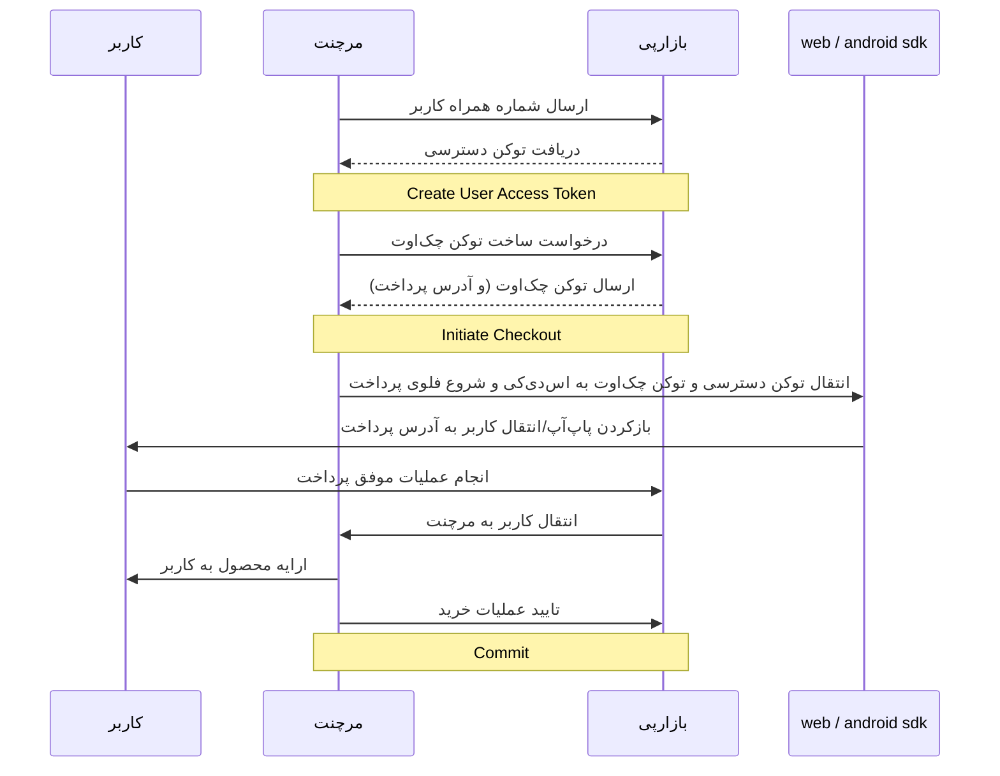

# احراز هویت کاربر به واسطه‌ی پذیرنده

در این فرایند کاربر به جای احراز هویت (لاگین) در بازارپی، در سایت یا اپلیکیشن پذیرنده (merchant) احراز هویت شده
و سپس شماره‌ی همراه وی توسط پذیرنده به بازارپی ارسال می‌شود تا برای این شماره‌ی همراه،
یک توکن دسترسی (access token) ساخته شود و از آن برای دسترسی کاربر به سرویس‌های بازارپی
استفاده گردد. لطفاً توجه کنید که این توکن دسترسی باید به ازای هر فرایند پرداخت مجدداً ساخته شود.

در این حالت، کاربر نیازی به لاگین مجزا در بازارپی ندارد. sdkهای کلاینت
که از این قابلیت احراز هویت اتوماتیک پشتیبانی می‌کنند (sdk اندروید
از [نسخه‌ی 5.2.0 به بعد](https://github.com/cafebazaar/BazaarPay/releases/tag/5.2.0))،
در صورتی که کاربر از قبل در بازارپی لاگین نباشد، از توکن دسترسی که
توسط مرچنت فراهم شده برای ادامه‌ی عملیات کاربر استفاده می‌کنند.

نمودار دنباله‌ی این فرایند را در زیر مشاهده می‌کنید:



## دریافت توکن دسترسی برای کاربر از سمت پذیرنده

پذیرنده بعد از احراز هویت کاربر در سایت خود، می‌تواند از طریق
اندپوینت `create-user-access-token`، برای شماره همراه کاربر توکن دسترسی دریافت نماید.
این توکن دسترسی فقط می‌تواند برای یکی از سه محدوده (scope) زیر مورد استفاده قرار گیرد:

1. خرید (purchase): برای خرید از طریق کیف پول، درگاه بانکی، و یا دایرکت‌دبیت
1. افزایش موجودی (increase_balance): برای فرآیند افزایش موجودی مستقیم کیف پول
1. پرداخت خودکار (direct_pay): برای فرآیند پرداخت خودکار

در صورتی که از توکن ایجادشده در محدوده‌ی دیگری استفاده کنید با خطای ۴۰۳ مواجه خواهید شد.

### نمونه درخواست

```yaml
openapi: 3.1.0
info:
  title: Create User Access Token API
  version: 1.0.0
servers:
  - url: 'https://{base_url}{base_path_v1}'
    description: BazaarPay API v1
paths:
  /merchant/create-user-access-token/:
    post:
      requestBody:
        content:
          application/json:
            schema:
              type: object
              properties:
                user_phone_number:
                  type: string
                  required: true
                  example: "09123456789 or 989123456789"
                  description: شماره همراه کاربر (مانند فرمت نمونه)
                scope:
                  required: true
                  type: string
                  enum:
                    - purchase
                    - increase_balance
                    - direct_pay
                  example: "purchase"
                  description: |
                    - purchase: دریافت توکن برای فرآیند خرید (خرید از طریق کیف پول، درگاه بانکی، و یا دایرکت‌دبیت)
                    - increase_balance: دریافت توکن برای فرآیند افزایش موجودی به‌طور مستقیم
                    - direct_pay: دریافت توکن برای فرآیند پرداخت خودکار (دایرکت‌پی)
      responses:
        '200':
          description: Success
          content:
            application/json:
              schema:
                type: object
                properties:
                  access_token:
                    type: string
                    example: "A1023e71738b4c1045529003314f429f0.81f023z="
        '401':
          $ref: './fa/shared-components/error-responses.md#/responses/401'
        '403':
          description: Permission Denied
          content:
            application/json:
              schema:
                oneOf:
                  - $ref: './fa/shared-components/error-responses.md#/responses/403/content/application/json/schema'
                  - $ref: '#/components/schemas/AutoLoginResponse'
        '400':
          $ref: './fa/shared-components/error-responses.md#/responses/400'
        '503':
          $ref: './fa/shared-components/error-responses.md#/responses/503'
components:
  securitySchemes:
    ApiKeyAuth:
      $ref: './fa/shared-components/security.md#/securitySchemes/ApiKeyAuth'
```

### نمونه cURL

```curl
curl --request POST 'https://pardakht.cafebazaar.ir/pardakht/badje/v1/merchant/create-user-access-token/' \
--header 'Content-Type: application/json; charset=utf-8' \
--header 'Authorization: Token {merchant_token}' \
--data-raw '{
    "scope": "purchase",
    "user_phone_number": "09123456789"
}'
```

### نمونه موفق پاسخ درخواست

```json
{
	"access_token": "A1y.023e717-8b4c1045529003314f429f0.81f023z="
}
```

در صورتی که پذیرنده پاسخی با کد وضعیت 403 دریافت کند،
باید فرایند پرداخت را بدون توکن دسترسی اتوماتیک ادامه دهد.
این اتفاق ممکن است به خاطر غیرفعال‌شدن موقتی قابلیت احراز هویت اتوماتیک به دلایل فنی رخ بدهد.

## احراز هویت خودکار در پلتفرم اندروید

برای دیدن نحوه‌ی احراز هویت اتوماتیک در SDK اندروید،
به [مستندات مربوط به sdk](https://github.com/cafebazaar/BazaarPay#2-launch-payment) مراجعه کنید.

## احراز هویت خودکار در پلتفرم وب

### احراز هویت با SDK وب

این روش در حال پیاده‌سازی می‌باشد و بزودی در دسترس قرار می‌گیرد.

### احراز هویت بدون SDK وب

این سرویس با استفاده از کوئری پارام، توکن احراز هویت کاربر را دریافت کرده و فرآیندهای مورد نظر را با استفاده از توکن
احراز هویت شده، انجام می‌دهد.

#### فراخوانی مستقیم وب‌سرویس

در هر انتری پوینت از وب‌سرویس با پاس دادن کوئری پارام `auto_login_token`، وب‌سرویس روش احراز هویت را اتولاگین تشخیص داده
و تا انتهای فرآیند مورد نظر،ِ کاربر با آن توکن احراز هویت خواهد شد. این نکته را در نظر بگیرید که مقدار این کوئری پارام
را باید توسط `access_token` که در اندپوینت `create-user-access-token` برگرداننده می‌شود مقداردهی نمایید.

#### ساختار کوئری پارام

```yaml
queryParams:
  # AutoLogin Query Param
  - name: auto_login_token
    type: string
    description: User's Auto Login access token
    example: eyJhwGciOsJIUzIdiIsInf5cCI6vIkfXrwJ9.eyJpc3MeOiJiYrwYqwYceirC
```

#### نمونه آدرس پرداخت بدون احراز هویت خودکار

```
https://{base_url}{base_path}/payment?token={checkout_token}&redirect_url={merchant_redirect_url}
```

#### نمونه آدرس پرداخت با احراز هویت خودکار

```
https://{base_url}{base_path}/payment?token={checkout_token}&redirect_url={merchant_redirect_url}&auto_login_token={auto_login_token}
```

#### نمونه استفاده از احراز هویت خودکار

```
https://cafebazaar.ir/bazaar-pay/payment?token=2220203584&redirect_url=https://bazaar-pay.ir&auto_login_token=eyJhwGciOsJIUzIdiIsInf5cCI6vIkfXrwJ9.eyJpc3MeOiJiYrwYqwYceirC
```

## دریافت شماره همراه کاربر از روی توکن دسترسی

کلاینت و sdkها می‌توانند برای به‌دست‌آوردن شماره‌ی همراه کاربر از روی توکن دسترسی
و نمایش شماره‌ی همراه در UI، از اندپوینت `user/info/` استفاده کنند.

### نمونه درخواست

```yaml
openapi: 3.1.0
info:
  title: Get User Info API
  version: 1.0.0
servers:
  - url: 'https://{base_url}{base_path_v1}'
    description: BazaarPay API v1
paths:
  /user/info/:
    get:
      responses:
        '200':
          description: Success
          content:
            application/json:
              schema:
                type: object
                properties:
                  phone_number:
                    type: string
                    example: "989123456789"
        '401':
          $ref: './fa/shared-components/error-responses.md#/responses/401'
        '403':
          $ref: './fa/shared-components/error-responses.md#/responses/403'
        '400':
          $ref: './fa/shared-components/error-responses.md#/responses/400'
        '503':
          $ref: './fa/shared-components/error-responses.md#/responses/503'
components:
  securitySchemes:
    ApiKeyAuth:
      $ref: './fa/shared-components/security.md#/securitySchemes/ApiKeyAuth'
```

### نمونه cURL

```curl
curl 'https://pardakht.cafebazaar.ir/pardakht/badje/v1/user/info/' \
     --header 'Authorization: Bearer {user_access_token}' \
     --header 'Accept: application/json'
```

### نمونه موفق پاسخ درخواست

```json
{
	"phone_number": "989123456789"
}
```

## نمونه خطاها

```yaml
components:
  schemas:
    AutoLoginResponse:
      type: object
      properties:
        detail:
          oneOf:
            - type: array
              items:
                type: string
            - type: string
        examples:
          permission_denied:
            value:
              description: وقتی پذیرنده دسترسی لازم برای ساختن توکن (برای خرید یا افزایش موجودی یا پرداخت خودکار) را ندارد.
              detail: "شما دسترسی لاگین اتوماتیک برای خرید را ندارید."
```
