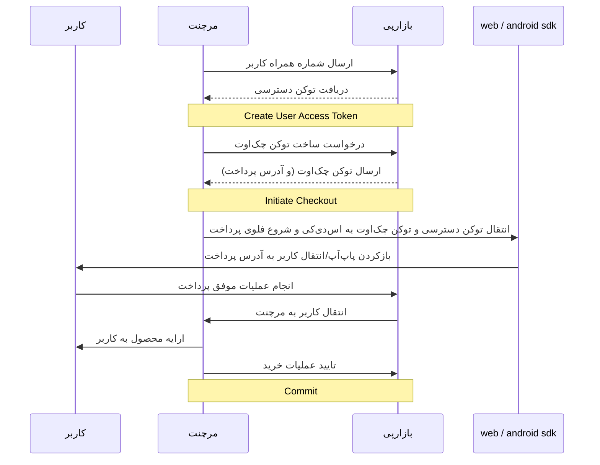

# احراز هویت کاربر به واسطه‌ی پذیرنده

در این فرایند کاربر به جای احراز هویت (لاگین) در بازارپی، در سایت یا اپلیکیشن پذیرنده (merchant) احراز هویت شده
و سپس شماره‌ی همراه وی توسط پذیرنده به بازارپی ارسال می‌شود تا برای این شماره‌ی همراه،
یک توکن دسترسی (access token) ساخته شود و از آن برای دسترسی کاربر به سرویس‌های بازارپی
استفاده گردد. لطفاً توجه کنید که این توکن دسترسی باید به ازای هر فرایند پرداخت مجدداً ساخته شود.

در این حالت، کاربر نیازی به لاگین مجزا در بازارپی ندارد. sdkهای کلاینت
که از این قابلیت احراز هویت اتوماتیک پشتیبانی می‌کنند (sdk اندروید از [نسخه‌ی 5.2.0 به بعد](https://github.com/cafebazaar/BazaarPay/releases/tag/5.2.0))،
در صورتی که کاربر از قبل در بازارپی لاگین نباشد، از توکن دسترسی که
توسط مرچنت فراهم شده برای ادامه‌ی عملیات کاربر استفاده می‌کنند.

نمودار دنباله‌ی این فرایند را در زیر مشاهده می‌کنید:


## دریافت توکن دسترسی برای کاربر از سمت پذیرنده

پذیرنده بعد از احراز هویت کاربر در سایت خود، می‌تواند از طریق
اندپوینت `create-user-access-token`، برای شماره همراه کاربر توکن دسترسی دریافت نماید.
این توکن دسترسی فقط می‌تواند برای یکی از سه محدوده (scope) زیر مورد استفاده قرار گیرد:
1. خرید (purchase): برای خرید از طریق کیف پول، درگاه بانکی، و یا دایرکت‌دبیت
1. افزایش موجودی (increase_balance): برای فرآیند افزایش موجودی مستقیم کیف پول
1. پرداخت خودکار (direct_pay): برای فرآیند پرداخت خودکار

در صورتی که از توکن ایجادشده در محدوده‌ی دیگری استفاده کنید با خطای ۴۰۳ مواجه خواهید شد.

### نمونه

```yaml
openapi: 3.1.0
info:
  title: BazaarPay API
  version: 1.0.0
servers:
  - url: 'https://{base_url}{base_path}'
paths:
  /merchant/create-user-access-token/:
    post:
      requestBody:
        content:
          application/json:
            schema:
              type: object
              properties:
                user_phone_number:
                  type: string
                  required: true
                  example: "09123456789 or 989123456789"
                  description: شماره همراه کاربر (مانند فرمت نمونه)
                scope:
                  required: true
                  type: string
                  enum:
                    - purchase
                    - increase_balance
                    - direct_pay
                  example: "purchase"
                  description: |
                    - purchase: دریافت توکن برای فرآیند خرید (خرید از طریق کیف پول، درگاه بانکی، و یا دایرکت‌دبیت)
                    - increase_balance: دریافت توکن برای فرآیند افزایش موجودی به‌طور مستقیم
                    - direct_pay: دریافت توکن برای فرآیند پرداخت خودکار (دایرکت‌پی)
      responses:
        '200':
          description: Success
          content:
            application/json:
              schema:
                type: object
                properties:
                  access_token:
                    type: string
                    example: "A1023e71738b4c1045529003314f429f0.81f023z="
        '401':
          $ref: './fa/shared_components/error-responses.md#/responses/401'
        '403':
          description: Permission Denied
          content:
            application/json:
              schema:
              - $ref: '#/components/schemas/PermissionDenied'
        '400':
          description: Bad Request
          content:
            application/json:
              schema:
                oneOf:
                - $ref: './fa/shared_components/error-responses.md#/responses/400/content/application/json/schema'
                - $ref: '#/components/schemas/BadRequest'
        '503':
          $ref: './fa/shared_components/error-responses.md#/responses/503'
components:
  securitySchemes:
    ApiKeyAuth:
      $ref: './fa/shared_components/security.md#/securitySchemes/ApiKeyAuth'
```

### نمونه cURL

```curl
curl --request POST 'https://pardakht.cafebazaar.ir/pardakht/badje/v1/merchant/create-user-access-token/' \
--header 'Content-Type: application/json; charset=utf-8' \
--header 'Authorization: Token {merchant_token}' \
--data-raw '{
    "scope": "purchase",
    "user_phone_number": "09123456789"
}'
```

### نمونه موفق پاسخ درخواست

```json
{
	"access_token": "A1y.023e717-8b4c1045529003314f429f0.81f023z="
}
```

## ارسال توکن دسترسی به sdk اندروید

برای دیدن نحوه‌ی احراز هویت اتوماتیک در sdk اندروید،
به [مستندات مربوط به sdk](https://github.com/cafebazaar/BazaarPay#2-launch-payment) مراجعه کنید.

## ارسال توکن دسترسی به sdk وب

مستندات مربوط به احراز هویت اتوماتیک در sdk وب در آینده نزدیک اعلام خواهد شد.

## دریافت شماره همراه کاربر از روی توکن دسترسی

کلاینت و sdkها می‌توانند برای به‌دست‌آوردن شماره‌ی همراه کاربر از روی توکن دسترسی
و نمایش شماره‌ی همراه در UI، از اندپوینت `user/info/` استفاده کنند.

### نمونه

```yaml
openapi: 3.1.0
info:
  title: BazaarPay API
  version: 1.0.0
servers:
  - url: 'https://{base_url}{base_path}'
paths:
  /user/info/:
    get:
      responses:
        '200':
          description: Success
          content:
            application/json:
              schema:
                type: object
                properties:
                  phone_number:
                    type: string
                    example: "989123456789"
        '401':
          $ref: './fa/shared_components/error-responses.md#/responses/401'
        '400':
          $ref: './fa/shared_components/error-responses.md#/responses/400'
        '503':
          $ref: './fa/shared_components/error-responses.md#/responses/503'
components:
  securitySchemes:
    ApiKeyAuth:
      $ref: './fa/shared_components/security.md#/securitySchemes/ApiKeyAuth'
```

### نمونه cURL

```curl
curl 'https://pardakht.cafebazaar.ir/pardakht/badje/v1/user/info/' \
     --header 'Authorization: Bearer {user_access_token}' \
     --header 'Accept: application/json'
```

### نمونه موفق پاسخ درخواست

```json
{
    "phone_number": "989123456789"
}
```

## نمونه خطاها

```yaml
components:
  schemas:
    PermissionDenied:
      type: object
      properties:
        detail:
        - type: string
        examples:
          permission_error:
            value:
              description: وقتی پذیرنده دسترسی لازم برای ساختن توکن (برای خرید یا افزایش موجودی یا پرداخت خودکار) را ندارد.
              detail: "شما دسترسی لاگین اتوماتیک برای خرید را ندارید."
    BadRequest:
      type: object
      properties:
        oneOf:
          detail:
            - type: string
          scope:
            - type: list
              items:
                - type: string
          user_phone_number:
            - type: list
              items:
                - type: string
        examples:
          invalid_scope:
            value:
              description: مقدار scope ارسال‌شده معتبر نیست
              scope: ["این اسکوپ انتخاب معتبری نیست."]
          invalid_user_phone_number:
            value:
              description: شماره تماس معتبر نیست.
              user_phone_number: ["شماره تماس معتبر نیست"]
```
